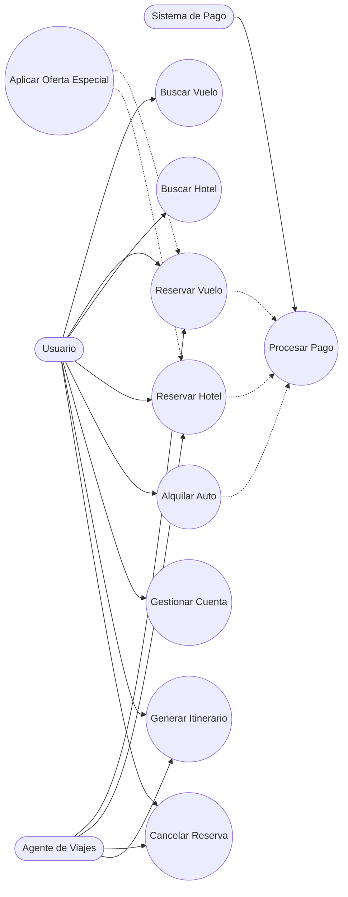

# Sistema de Reservas de Viajes en Línea

---

## 1. Quiénes usan el sistema

### Usuario
La persona que entra a la web o app para buscar vuelos, reservar hoteles, alquilar autos y manejar su cuenta. También puede ver su itinerario de viaje.

### Agente de Viajes
El empleado de la empresa que ayuda a los usuarios haciendo reservas, cambios o cancelaciones, y también genera itinerarios cuando hace falta.

### Sistema de Pago
Es el servicio externo que se encarga de cobrar las reservas que se hacen en la plataforma.

---

## 2. Qué se puede hacer en el sistema

### Buscar Vuelo
Ver qué vuelos hay disponibles según el destino y las fechas que quieras.

### Reservar Vuelo
Elegir un vuelo y reservarlo.

### Buscar Hotel
Ver hoteles disponibles en el lugar al que vas.

### Reservar Hotel
Elegir un hotel y hacer la reserva.

### Alquilar Auto
Reservar un coche para tu viaje.

### Gestionar Cuenta de Usuario
Registrarte, iniciar sesión o cambiar tus datos personales.

### Generar Itinerario de Viaje
Tener un resumen con todas tus reservas juntas en un solo documento.

### Procesar Pago
Pagar las reservas que hiciste.

### Cancelar Reserva
Cancelar alguna reserva si cambias de planes.

### Aplicar Oferta Especial
Usar descuentos o promociones en tus reservas.

---

## 3. Cómo se conectan las cosas

- Cada vez que reservas un vuelo, un hotel o un auto, **siempre pasa por el pago**.
- Las **ofertas especiales** se pueden aplicar cuando reservas un vuelo o un hotel.
- Si necesitas **cancelar una reserva**, también se conecta con los casos de reserva.
- El **itinerario** junta todas las reservas en un solo resumen.

---

## 4. Diagrama de Casos de Uso

