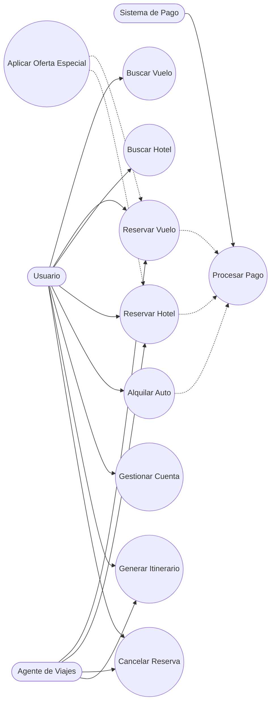

```mermaid
flowchart LR

    Usuario([Usuario])
    Agente([Agente de Viajes])
    Pago([Sistema de Pago])

    BuscarVuelo((Buscar Vuelo))
    ReservarVuelo((Reservar Vuelo))
    BuscarHotel((Buscar Hotel))
    ReservarHotel((Reservar Hotel))
    AlquilarAuto((Alquilar Auto))
    GestionarCuenta((Gestionar Cuenta))
    Itinerario((Generar Itinerario))
    CancelarReserva((Cancelar Reserva))
    ProcesarPago((Procesar Pago))
    Oferta((Aplicar Oferta Especial))

    Usuario --> BuscarVuelo
    Usuario --> ReservarVuelo
    Usuario --> BuscarHotel
    Usuario --> ReservarHotel
    Usuario --> AlquilarAuto
    Usuario --> GestionarCuenta
    Usuario --> Itinerario
    Usuario --> CancelarReserva

    Agente --> ReservarVuelo
    Agente --> ReservarHotel
    Agente --> CancelarReserva
    Agente --> Itinerario

    ReservarVuelo -.-> ProcesarPago
    ReservarHotel -.-> ProcesarPago
    AlquilarAuto -.-> ProcesarPago

    Pago --> ProcesarPago

    Oferta -.-> ReservarVuelo
    Oferta -.-> ReservarHotel
```
